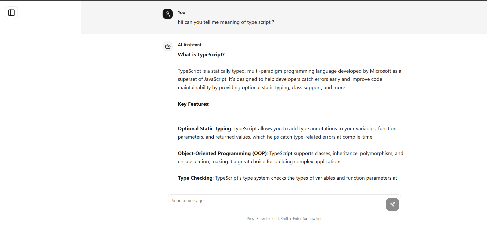
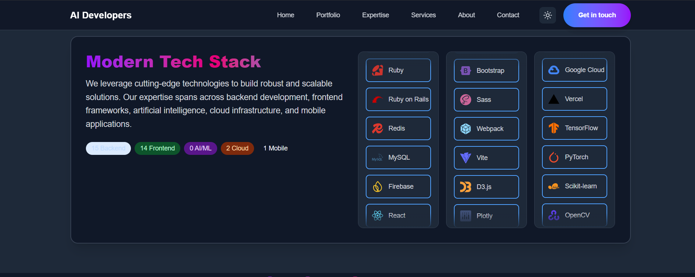
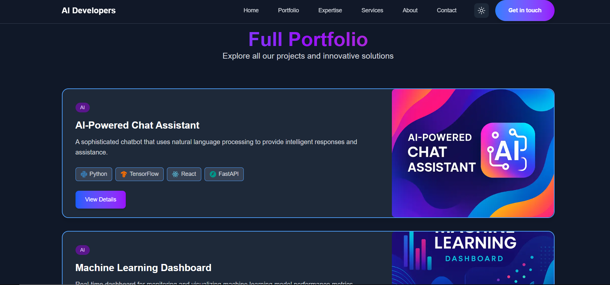
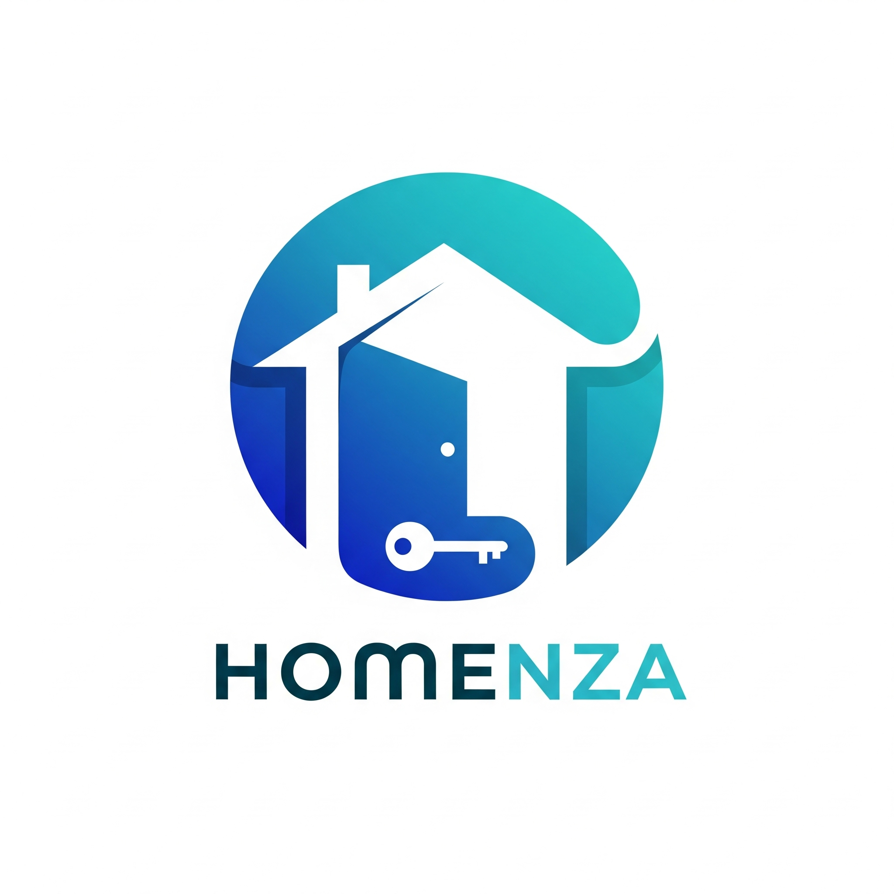
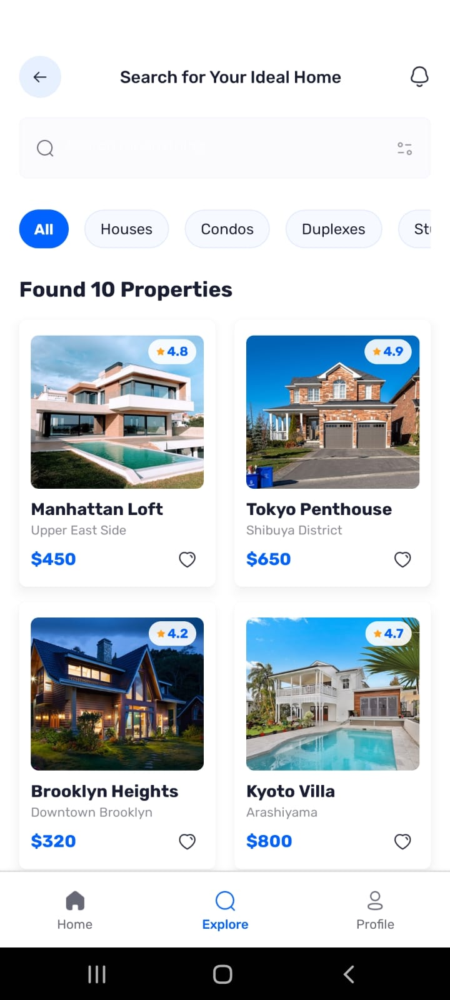
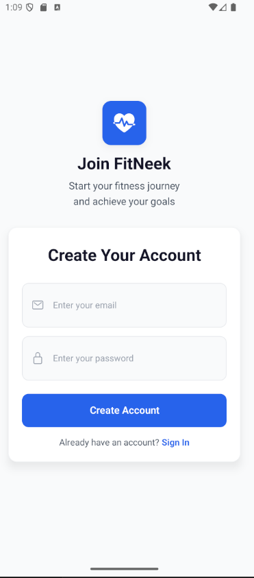
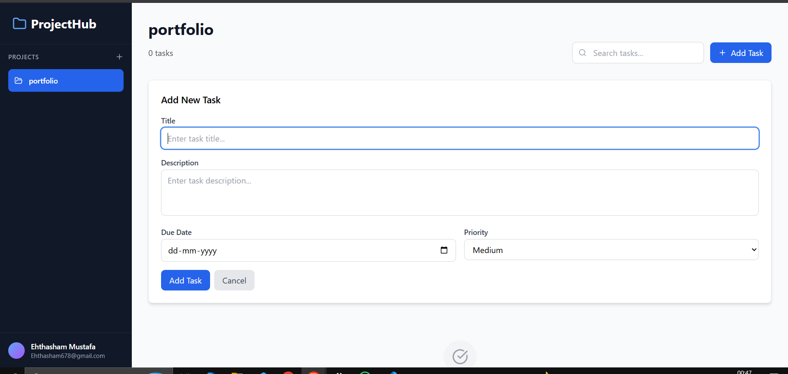
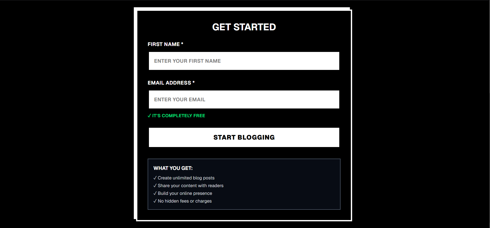
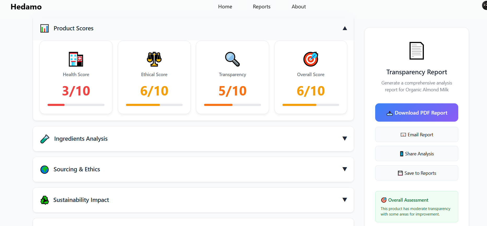
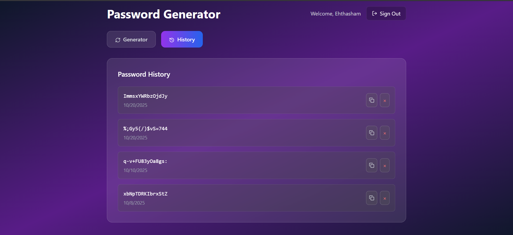

# 💫 About Me:
👋 Hi, I'm Ehthasham Mustafa I am a a Full Stack AI/ML Engineer with experience in building end-to-end applications that combine modern web technologies with machine learning models. Just Saying I didn't use ChatGPT to write this description.

## 🌐 Socials:
      

# 💻 Tech Stack:
                                       

# 🔥 LeetCode Stats:

# 📊 GitHub Stats:
 
 

## 📚 Projects

Below are the projects showcased on this portfolio. Click a screenshot to open the live demo (if available) or the GitHub repo. Images reference files inside the `assets/projects-screenshots/` folder so they will render on GitHub once pushed.

---
### ChatGPT Clone 🤖
- **Description:** ChatGPT-like chatbot with responsive UI and auth flows.
- **Tech Stack:** React, Node.js, Express, MongoDB, Tailwind
- **Live Demo:** https://chatbot-chi-rouge.vercel.app/
- **GitHub:** https://github.com/Itz-Ehthasham/ChatGpt
- **Features:** Interactive chat UI, authentication (signup/login/OTP)

  
  

### AI-Dev-Web 🧠
- **Description:** Developers who build AI — showcasing projects that push the boundaries of AI, ML, and modern web development excellence.
- **Tech Stack:** TypeScript, Next.js, Tailwind, Shadcn
- **Live Demo:** https://ai-dev-seven.vercel.app/
- **GitHub:** https://github.com/Itz-Ehthasham/AI-dev-web
- **Features:** Portfolio-style project showcase, slideshow gallery

  
  
  

---

### Homenza 🏠
- **Description:** Comprehensive real estate mobile application for property search and discovery.
- **Tech Stack:** React, TypeScript, Firebase
- **Live Demo:** https://expo.dev/accounts/ehthasham/projects/homenza/builds/cac13d3b-2e96-4a09-90d4-216d612ce0b1
- **GitHub:** https://github.com/Itz-Ehthasham/Homenza
- **Features:** Mobile-focused UX, property browsing, user profiles

  
  
  

---

### Fit-Neek 🏋️‍♂️
- **Description:** AI-powered fitness app providing personalized workouts, nutrition guidance, and tracking.
- **Tech Stack:** React, TypeScript, Firebase
- **Live Demo:** coming soon...
- **GitHub:** https://github.com/Itz-Ehthasham/Fit-Neek
- **Features:** AI-driven personalization, workout plans

  
  

---

### Hybrid Learning 📚
- **Description:** ML-based app to predict whether online or offline learning suits a student based on academic and behavioral features.
- **Tech Stack:** JavaScript, React, Python, MongoDB
- **Live Demo:** https://github.com/Itz-Ehthasham/Hybrid_learning_Prediction
- **GitHub:** https://github.com/Itz-Ehthasham/Hybrid_learning_Prediction
- **Features:** ML prediction model, admin interface

  
  
  

---

### Project Management App 📋
- **Description:** Modern project/task management app with a clean component structure.
- **Tech Stack:** React, JavaScript
- **GitHub:** https://github.com/Itz-Ehthasham/-Project-Task--Management
- **Features:** Task creation, priority and project organization

  
  

---

### Blog App ✍️
- **Description:** Full-stack MERN blogging platform with full CRUD operations and content management.
- **Tech Stack:** React, Node.js, Express, MongoDB
- **Live Demo:** https://blog-app-smoky-nine.vercel.app/blogs
- **GitHub:** https://github.com/Itz-Ehthasham/Blog_app
- **Features:** Create/read/update/delete posts, search and featured pages

  
  

---

### Hedamo 🔍
- **Description:** Collects product information via dynamic questions and generates Product Transparency Reports (AI-integrated).
- **Tech Stack:** React, Node.js, Express, MongoDB, Tailwind
- **Live Demo:** https://hedamo.up.railway.app/
- **GitHub:** https://github.com/Itz-Ehthasham/Hedamo
- **Features:** Dynamic question flow, product analysis and reporting

  
  

---

---

### Password Generator 🔐
- **Description:** Simple and efficient password generator with configurable criteria.
- **Tech Stack:** React, TypeScript, Tailwind
- **Live Demo:** https://password-generator-gamma-blond-24.vercel.app/
- **GitHub:** https://github.com/Itz-Ehthasham/password-generator
- **Features:** Password generation, history log, authentication

  
  

---

### Interactive Gallery 🎞️
Open the interactive, infinite horizontal gallery of all project screenshots (hover to slow it down):

[Open gallery (interactive demo)](./assets/projects-screenshots/gallery.html)

  

> **Note:** GitHub's README pages do not execute JavaScript for security reasons. Open the linked `gallery.html` file in your browser or serve the repository (or deploy via GitHub Pages) to see the animated infinite scroll with hover slowdown.

