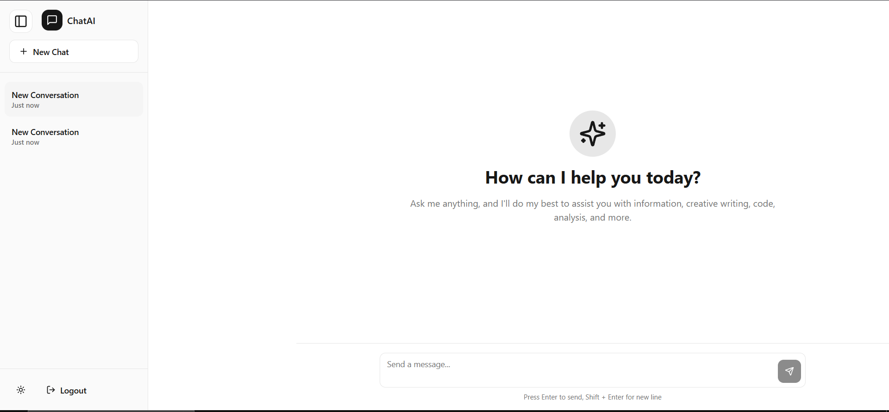
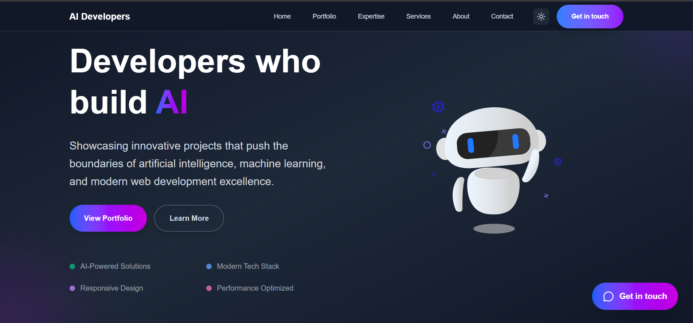
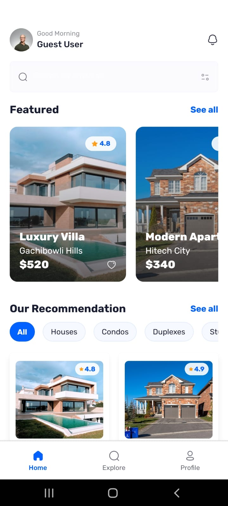
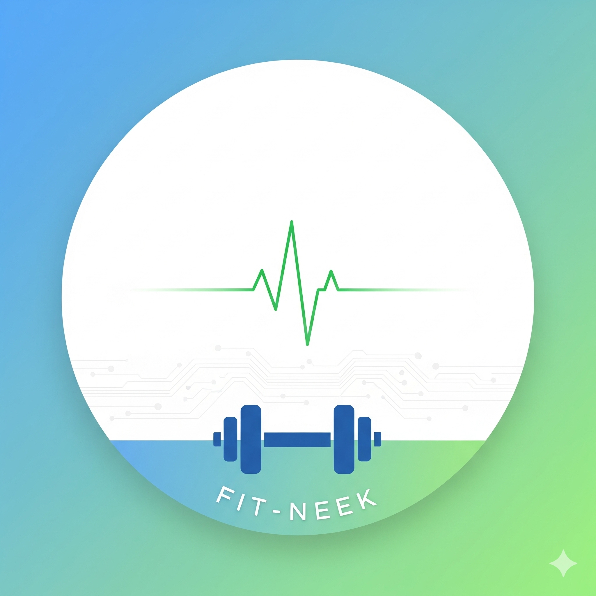
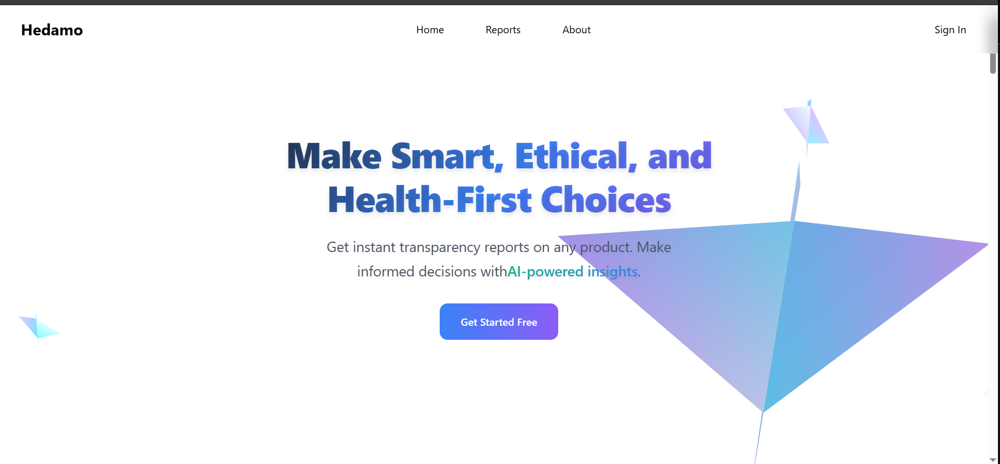
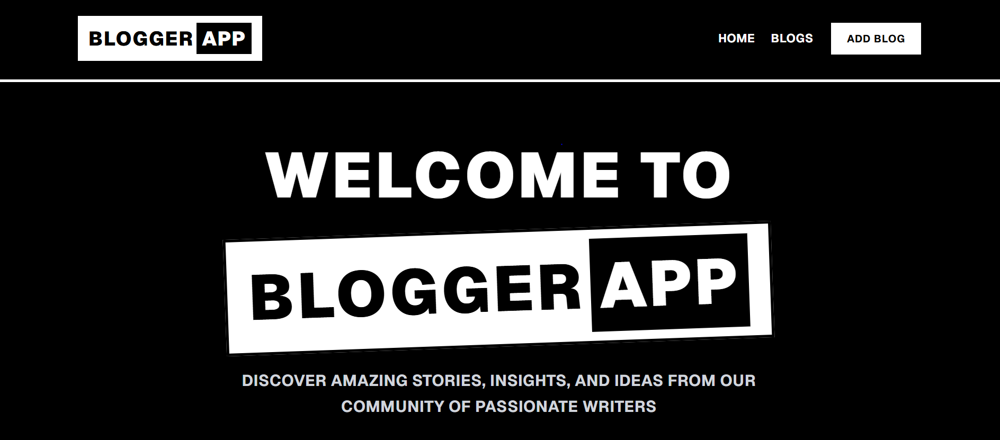

# 💫 About Me:
👋 Hi, I'm **Ehthasham Mustafa**

I am a Full Stack AI/ML Engineer with experience in building end-to-end applications that combine modern web technologies with machine learning models.
I pay close attention to details, thoroughly scan screens and code.
Nerd when it comes to coding and Software Things .....

* I didn't use ChatGPT to write this description.

---

## 🌐 Socials:
      
---

## 💻 Tech Stack:
                                       

---

## 🔥 LeetCode Stats:

---

## 📊 GitHub Stats:

## 🚀 Featured Projects

<table>
<tr>
<td width="50%">

### 🤖 ChatGPT Clone
ChatGPT-like chatbot with responsive UI and authentication flows.

**Tech Stack:** `React` `Node.js` `Express` `MongoDB` `Tailwind`

**Features:**
- Interactive chat interface
- User authentication (signup/login/OTP)
- Real-time messaging

</td>
<td width="50%">

### 🧠 AI-Dev-Web
Portfolio showcasing AI, ML, and modern web development projects.

**Tech Stack:** `TypeScript` `Next.js` `Tailwind` `Shadcn`

**Features:**
- Portfolio-style showcase
- Slideshow gallery
- Modern responsive design

</td>
</tr>

<tr>
<td width="50%">

### 🏠 Homenza
Comprehensive real estate mobile application for property search and discovery.

**Tech Stack:** `React Native` `TypeScript` `Firebase`

**Features:**
- Mobile-focused UX
- Property browsing
- User profiles & favorites

</td>
<td width="50%">

### 🏋️‍♂️ Fit-Neek
AI-powered fitness app providing personalized workouts and nutrition guidance.

**Tech Stack:** `React Native` `TypeScript` `Firebase`

**Features:**
- AI-driven personalization
- Custom workout plans
- Progress tracking

</td>
</tr>

<tr>
<td width="50%">

### 📚 Hybrid Learning Predictor
ML-based app predicting optimal learning mode (online/offline) for students.

**Tech Stack:** `React` `Python` `MongoDB` `scikit-learn`

**Features:**
- ML prediction model
- Student analytics dashboard
- Admin interface

</td>
<td width="50%">

### 🔍 Hedamo
AI-integrated product transparency platform generating detailed product reports.

**Tech Stack:** `React` `Node.js` `Express` `MongoDB` `Tailwind`

**Features:**
- Dynamic question flows
- AI-powered analysis
- Product transparency reports

</td>
</tr>

<tr>
<td width="50%">

### ✍️ Blog App
Full-stack MERN blogging platform with complete content management.

**Tech Stack:** `React` `Node.js` `Express` `MongoDB`

**Features:**
- Full CRUD operations
- Search functionality
- Featured posts section

</td>
<td width="50%">

### 🔐 Password Generator
Secure password generator with customizable criteria and history tracking.

**Tech Stack:** `React` `TypeScript` `Tailwind`

**Features:**
- Configurable password criteria
- Password history log
- User authentication

</td>
</tr>

<tr>
<td width="50%">

### 📋 Project Management App
Modern task and project management application with intuitive UI.

**Tech Stack:** `React` `JavaScript`

**Features:**
- Task creation & editing
- Priority management
- Project organization

</td>
<td width="50%">

</td>
</tr>

</table>

---

  
### 💡 *"Building the future, one commit at a time"*

